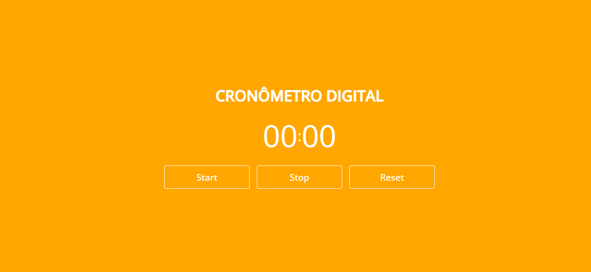

<h1 align="center">Cronômetro Digital</h1>

  

## 📁 Sobre o Projeto

Projto onde criei um cronômetro digital usando HTML, CSS e JavaScript.

##

## 🚀 Tecnologias Utilizadas

- HTML
- CSS
- JavaScript
